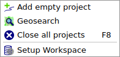
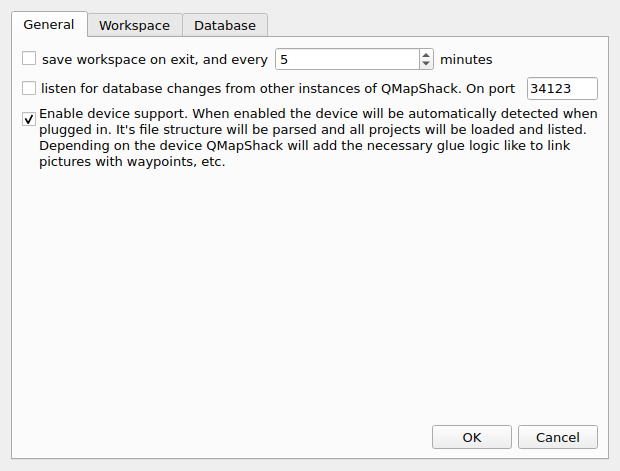
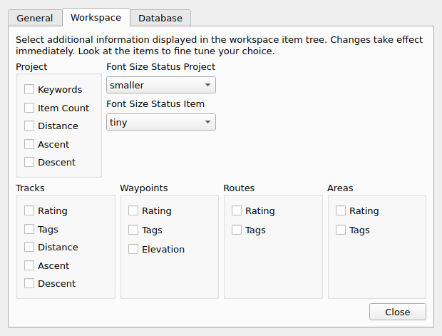
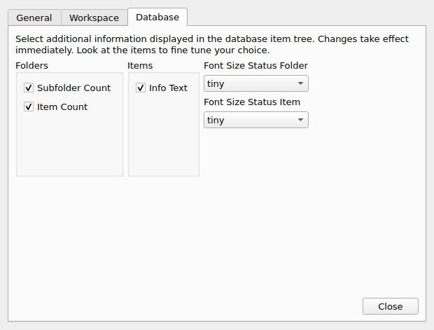
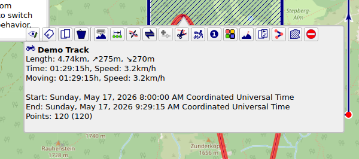
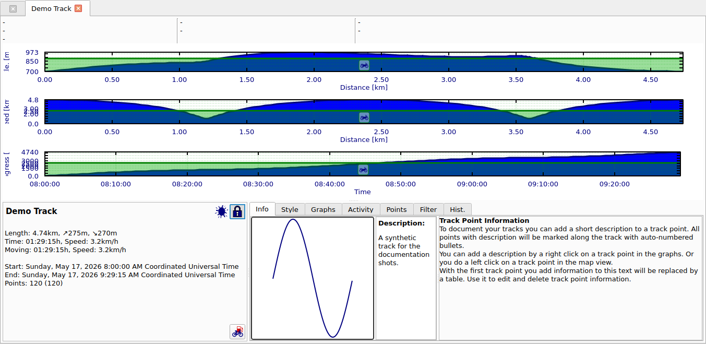
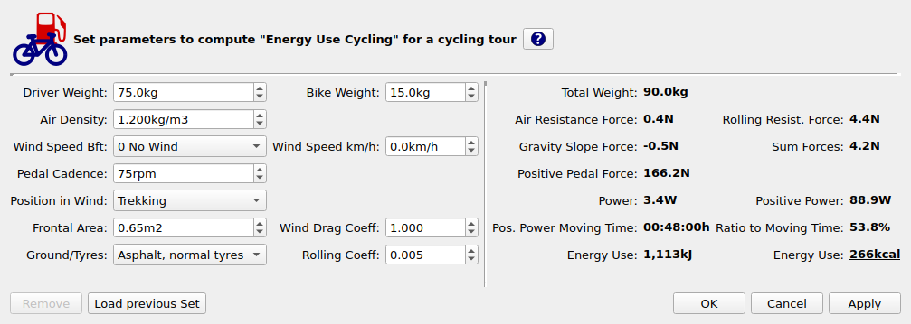

# test page to see what is working

## this is a test chapter

use 

bla bla

do it.

blib

## the overlay over the map

click on the track, these are the options you get

afasdfsdfqsgfqqs

asdgasgsf

